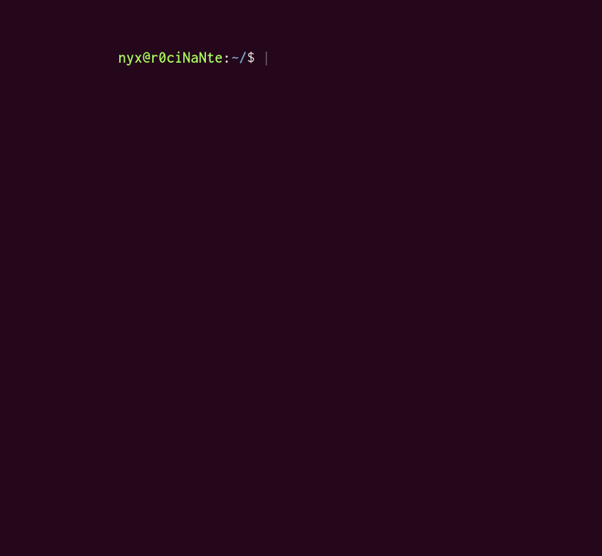
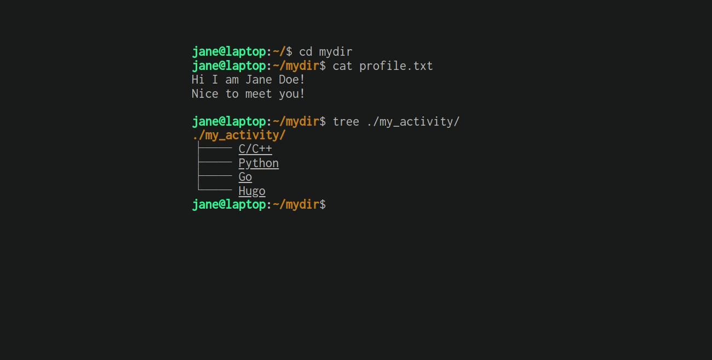
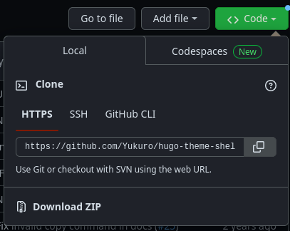
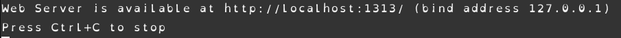
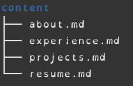
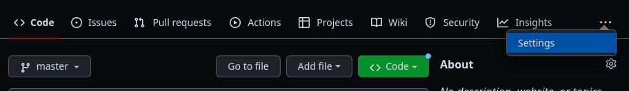

# Hosting a resume using Hugo and GitHub Pages

This README will go over how to create, and then host your resume on GitHub Pages using the Hugo static site generator. 

## Getting Started


These instructions will go over getting Hugo up and running on your machine, then hosting it on GitHub Pages. These instructions also assume that you have some basic programming knowledge and can navigate through markdown, opening and using both terminals and git by yourself. I made the following using these instructions.



Using a lightweight markdown based resume has it's advantages for when it comes to hosting your resume online quickly and easily. It is a well documented language that is simple enough to pick up and modify whenever you need. 

Andrew Etter in their book Modern Technical Writing recommends markdown languages in addition to the static site generators and distributed version control we are using here. They are using it for writing documentation, but this workflow works very well for hosting a resume as well. It allows for a quick and easy to maintain system that can be updated automatically whenever you need, which allows you to keep an up to date resume that employers can find whenever they need. 

### Prerequisites


- [A GitHub account](https://github.com/)
- Some way to modify files and push changes to GitHub ([VSCode](https://code.visualstudio.com/) is used here for both, but any environment you're comfortable with will work)
- a resume formatted in [Markdown](https://www.markdownguide.org/getting-started/), this will serve as the website content


### Installing and setting up Hugo

We start by setting up Hugo, these instructions are made for Ubuntu or Debian (or Windows using Ubuntu WSL), but will include links to resources for other OS options where applicable. 

1. Open a terminal for your system, or WSL if on windows. 

2. [Install Hugo](https://gohugo.io/installation/linux/) with `apt`

```bash
sudo apt install hugo
```

3. [Choose a theme](https://themes.gohugo.io/) for your site, and navigate to the download option. This *should* bring you to the theme's GitHub, keep this tab open for later. 
	- (If it does not bring you to the theme's GitHub, see if you can find specific install instructions for that theme)

We chose the [shell theme](https://themes.gohugo.io/themes/hugo-theme-shell/), which opens with this nice little animation on the homepage.



4. Create a new website, replacing `your-site` with the name of the directory.

```bash
hugo new site your-site
cd your-site
git init
```

5. Apply the theme you chose earlier, it may have specific instructions, but the majority of them will use instructions similar to below. Keep your `theme-name`  in mind, you will need it later while deploying.

```bash
git submodule add github-clone-link themes/theme-name
```

- You can get the GitHub clone link with the following option in the theme's repo you found in step 3. 



6. Run the following and make sure everything is running properly.

```bash
hugo server -t theme-name -w -D
```

It will show a link to the locally hosted site at the bottom, it should look like this:



If everything looks good, you're all set to modify it and begin deployment!

### Putting your resume on the website

Each theme may have specific instructions to get your resume and information on it. It's recommended you read the README the theme provides. Below are general instructions that may work regardless.

1. Begin by putting your resume markdown file inside the content folder of your website directory. 

In the following image I have additional markdown files I use for the theme, but only `resume.md` is required.



 2. Modify the default theme, go into the theme's config file and modify settings to your liking. You can preview changes with the live server from the previous section. 

3. Add additional files, some themes require additional files in order to render the website as desired, these may be images, additional markdown files, or something else. These will be outlined in the config file, and/or the README.

### Deploying on GitHub Pages

Time to host the site on GitHub pages! Following this method will allow you to easily rebuild and deploy your site with any future changes. This is the beauty of this method, deploying static sites with distributed version control makes for a super easy workflow.

1. Push the git repository you made on your local machine to GitHub. 
	- Note that it is not longer possible to use terminal git without using SSH keys, it is recommended you use git built into an IDE or [GitHub Desktop](https://desktop.github.com/) to do so.

2. Navigate to the newly created repository.

3. Open setting along the top bar as pictured.



4. Navigate to the Pages tab along the left navigation bar.

5. Change the source under **Build and Deployment** to **GitHub Actions**

6. Create a workflow, it may provide an option to deploy from Hugo automatically, if so, follow those steps. If not, create an empty file in your local repository.

```
.github/workflows/hugo.yaml
```

7. Copy the YAML below into the empty file you created. You MUST change theme-name to the name used earlier. Change the branch name and Hugo version as needed.

```yaml
# Sample workflow for building and deploying a Hugo site to GitHub Pages
name: Deploy Hugo site to Pages

on:
  # Runs on pushes targeting the default branch
  push:
    branches:
      - main

  # Allows you to run this workflow manually from the Actions tab
  workflow_dispatch:

# Sets permissions of the GITHUB_TOKEN to allow deployment to GitHub Pages
permissions:
  contents: read
  pages: write
  id-token: write

# Allow one concurrent deployment
concurrency:
  group: "pages"
  cancel-in-progress: true

# Default to bash
defaults:
  run:
    shell: bash

jobs:
  # Build job
  build:
    runs-on: ubuntu-latest
    env:
      HUGO_VERSION: 0.111.2
    steps:
      - name: Install Hugo CLI
        run: |
          wget -O ${{ runner.temp }}/hugo.deb https://github.com/gohugoio/hugo/releases/download/v${HUGO_VERSION}/hugo_extended_${HUGO_VERSION}_linux-amd64.deb \
          && sudo dpkg -i ${{ runner.temp }}/hugo.deb          
      - name: Install Dart Sass Embedded
        run: sudo snap install dart-sass-embedded
      - name: Checkout
        uses: actions/checkout@v3
        with:
          submodules: recursive
          fetch-depth: 0
      - name: Setup Pages
        id: pages
        uses: actions/configure-pages@v3
      - name: Install Node.js dependencies
        run: "[[ -f package-lock.json || -f npm-shrinkwrap.json ]] && npm ci || true"
      - name: Build with Hugo
        env:
          # For maximum backward compatibility with Hugo modules
          HUGO_ENVIRONMENT: production
          HUGO_ENV: production
        run: |
          hugo -t theme-name \
            --gc \
            --minify \
            --baseURL "${{ steps.pages.outputs.base_url }}/"          
      - name: Upload artifact
        uses: actions/upload-pages-artifact@v1
        with:
          path: ./public

  # Deployment job
  deploy:
    environment:
      name: github-pages
      url: ${{ steps.deployment.outputs.page_url }}
    runs-on: ubuntu-latest
    needs: build
    steps:
      - name: Deploy to GitHub Pages
        id: deployment
        uses: actions/deploy-pages@v1
```

8. Commit the change to your local repository and push to GitHub.

9. Choose actions from GitHub's main menu, you should see an action running. It will turn green when completed. 

10. Go check out your site! There should be a link to the website under the pages tab in the GitHub repository. 

Any future changes pushed to the repository will cause it to rebuild your site and deploy again. 


## More Resources

- [Etter's Book on Modern Technical Writing](https://www.amazon.ca/Modern-Technical-Writing-Introduction-Documentation-ebook/dp/B01A2QL9SS) - goes over markdown languages, version control, and static site generators
- [Markdown Guide](https://www.markdownguide.org/)
- [Hugo Installation](https://gohugo.io/installation/linux/)
- [Hosting Hugo on Github](https://gohugo.io/hosting-and-deployment/hosting-on-github/) - general instructions, the YAML shown here may be incomplete, using the one provided above has a workaround
- [Hugo Themes](https://themes.gohugo.io/)

## FAQs

1. "Why is Markdown better than a word processor?"
	- Markdown is very easy to modify, everything remains a consistent easy to follow format. There is no fiddling with alignment or spacing required. Using the full stack method we've outlined here, any changes made to the resume will appear on the website quickly and without extra effort. 

2. "Why is my theme not showing up on GitHub pages but I can see it locally?"
	- Hugo themes can be somewhat finicky when building. Try running the command `hugo` inside the directory that contains the website files. If the built version does not show the theme, make sure you have the following line in your GitHub actions workflow YAML file. Replace the `theme-name` with the theme name you installed, you can find the `theme-name` in the `.gitmodules` file.

```YAML
        run: |
          hugo -t theme-name \
```

3. "My theme does not work with your instructions!"
	- Each theme will have specific instructions to modify and make it yours. I highly recommend reading the individual README that comes with each theme, that should be able to help!

## Authors and Acknowledgements

Thanks to Yukuro for creating the wonderful [shell theme](https://themes.gohugo.io/themes/hugo-theme-shell/).
Thanks to PurpleBooth for the useful [README](https://github.com/PurpleBooth/a-good-readme-template) template.

And finally thanks to Parth Patel, Eddie Wat, and Omar Taha for proofreading both this README and my resume.